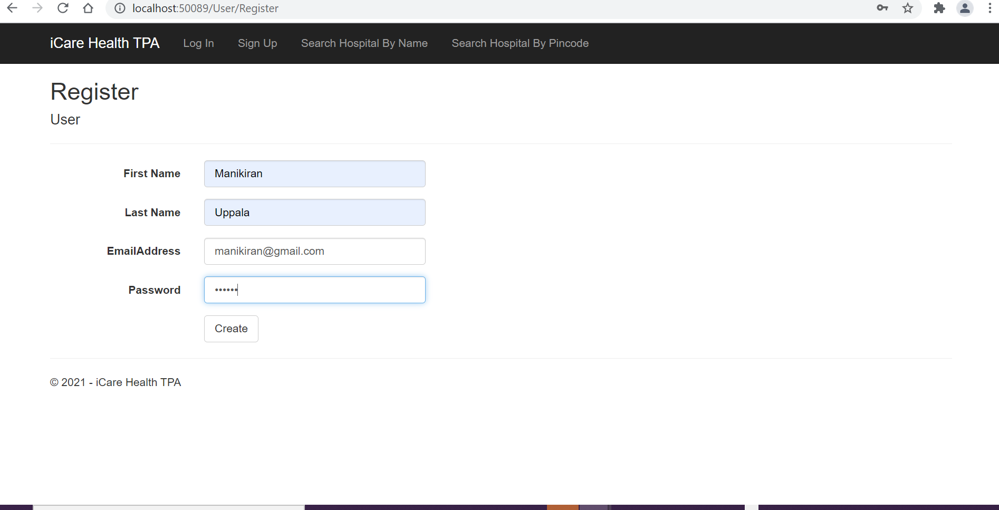
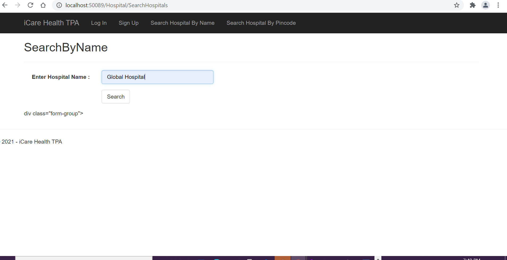
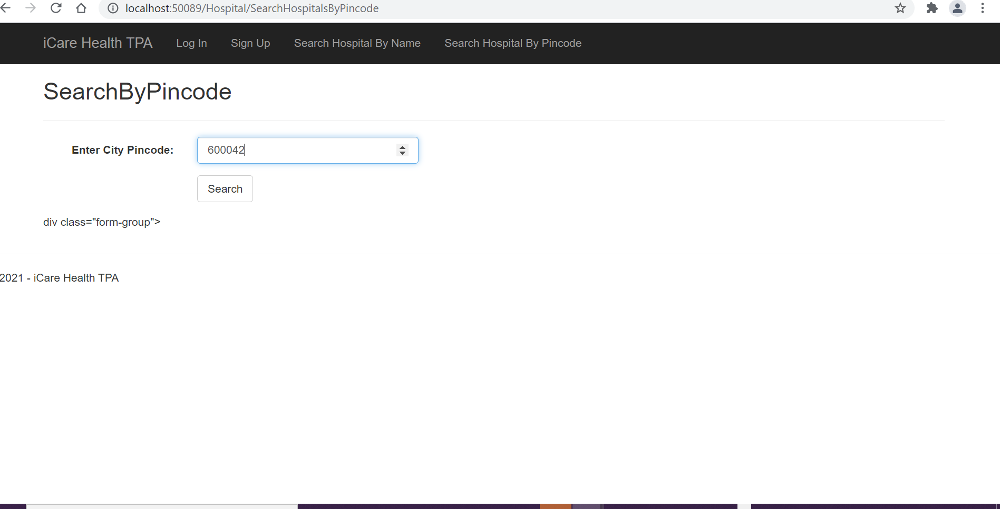
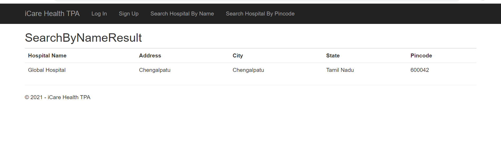
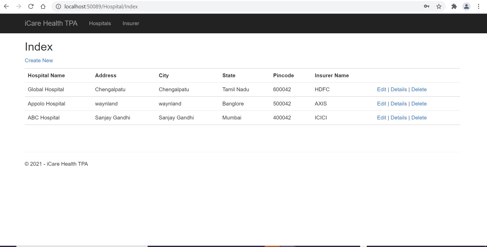
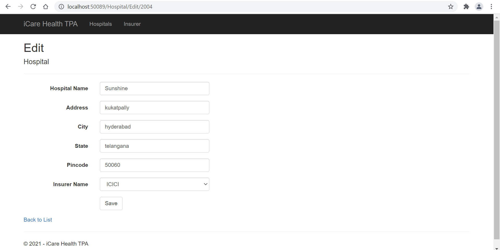
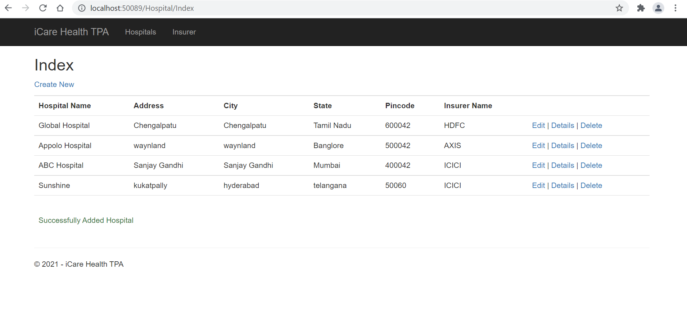
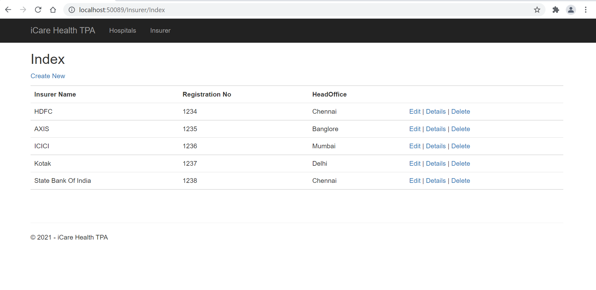

# INSURANCE-MANAGEMENT-SYSTEM
This Application is a health insurance TPA(third party administrator) which provides hurdle-free third party administration for health insurance for different IT corporates. There are many health insurance providers which are registered with them. Also this system has tied up with several network hospitals to provide cashless hospitalization service.

1. SIGN UP

2.UNREGISTERED USER CAN SEARCH HOSPITAL BY NAME

3.UNREGISTERED USER CAN SEARCH HOSPITAL BY PINCODE

4.UNREGISTERED USER SEARCH RESULT

5. LOGIN

6.HOSPITALS LIST

7. CREATE HOSPITAL

8.HOSPITALS LIST AFTER CREATING

9.DELETE HOSPITAL

10.INSURER DETAILS

